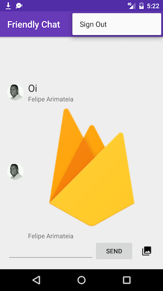

# Codelab

Neste codelab, iremos aprender a plataforma Firebase para criar facilmente aplicativos Android.

Vamos implementar um chat, com autenticação e envio de photos.

## Sign In

## Chat

## Sign Out

## Projeto Base

* [http://bit.ly/digitaldayand](http://bit.ly/digitaldayand)

## Baseado

[Firebase Android Codelab](https://codelabs.developers.google.com/codelabs/firebase-android/#0)
